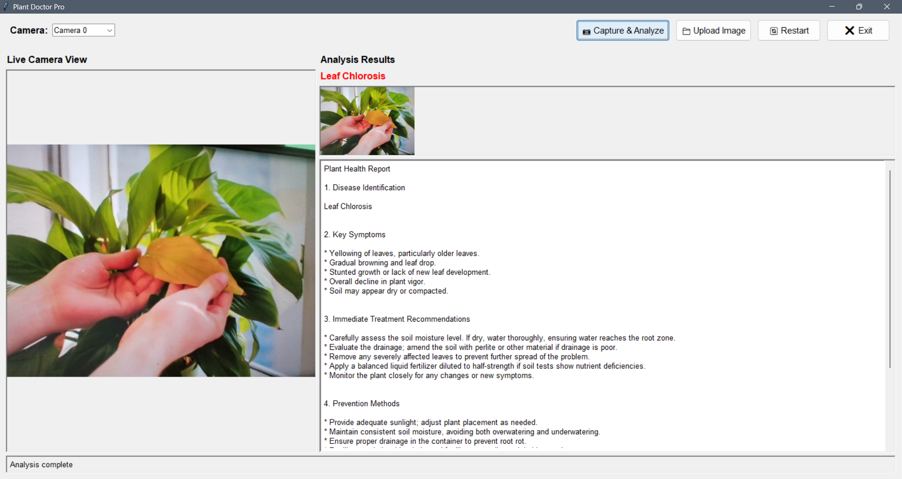

# 🌿 Plant Doctor Pro – Plant Disease Identification Using ML (Gemini 1.5 Flash)



## 🔍 Overview

**Plant Doctor Pro** is a desktop application for real-time and image-based plant disease identification using **machine learning** powered by **Google Gemini 1.5 Flash**. With a user-friendly GUI built using **Tkinter**, this tool helps farmers, agronomists, researchers, and gardening enthusiasts detect plant diseases from leaf images and get professional treatment and prevention advice.

## ✨ Features

- 🔬 **Plant Disease Detection using ML (Gemini 1.5 Flash)**
- 📷 **Live Camera Feed + Capture & Analyze**
- 📁 **Upload Image from Disk**
- 🧠 **AI-generated professional plant health report**
- 📊 **Sections: Disease Name, Symptoms, Treatment, Prevention, Notes**
- 🖼️ **Smart image preview and resizing**
- 💻 **Cross-platform GUI using Tkinter**

## 🧠 How It Works

1. Captures or uploads an image of a plant/leaf.
2. Sends the image to Gemini 1.5 Flash with a structured prompt.
3. Receives a detailed diagnosis with:
   - Disease name
   - Key symptoms
   - Immediate treatment
   - Prevention tips
   - Additional recommendations

## 🛠️ Tech Stack

- **Language:** Python
- **GUI:** Tkinter
- **Image Processing:** OpenCV, PIL
- **ML/AI Backend:** Google Gemini 1.5 Flash via `google.generativeai`

## 🚀 Getting Started

### 🔧 Prerequisites

- Python 3.8+
- Google API Key with access to Gemini 1.5 Flash

### 📦 Installation

1. Clone the repository:

```bash
git clone https://github.com/your-username/plant-disease-identification-ml.git
cd plant-disease-identification-ml
```

2. Install dependencies:

```bash
pip install google-generativeai opencv-python Pillow
```

3. Replace the placeholder API key in the code with your own Google API key.

4. Run the application:

```bash
app.py
```


## 🔐 Api Note

Don't forget to get your Gemini API key from [Google Gemini API documentation](https://ai.google.dev/gemini-api/docs/api-key).


